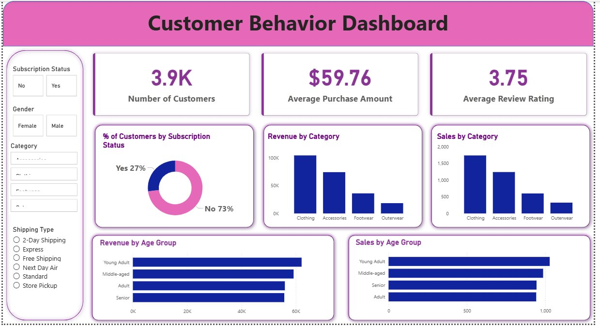

# 👨🏻‍💻 Customer Shopping Behavior Analysis

An end-to-end data analytics project analyzing 3,900 customer transactions to uncover revenue drivers, customer segments, and purchasing behavior trends.

---

## 📌 Business Problem

An e-commerce business wants to understand:

- Which customer segments drive the most revenue?
- How subscription status impacts spending behavior
- Which products are discount-dependent
- How age groups contribute to total revenue
- Whether repeat buyers are more likely to subscribe

The objective is to generate actionable insights to improve retention, marketing strategy, and revenue optimization.

---
📂 Repository Structure

Notebook → data cleaning

SQL file → business queries

PBIX → dashboard

PDF → detailed report

---

## 📊 Dashboard Preview

---

## 📊 Dataset Summary

- **Rows:** 3,900 transactions  
- **Columns:** 18 features  
- Includes:
  - Customer demographics (Age, Gender, Location, Subscription Status)
  - Purchase details (Category, Amount, Season, Size, Color)
  - Behavioral metrics (Discount Applied, Previous Purchases, Review Rating)
- 37 missing values handled using median imputation by category

---

## 🛠️ Tools & Technologies

- **Python (pandas, NumPy)** – Data cleaning & feature engineering  
- **PostgreSQL** – Business query analysis  
- **Power BI** – Interactive dashboard & storytelling  

---

## 🔍 Key Insights

### 💰 Revenue by Gender
- Male customers generated **$157,890**
- Female customers generated **$75,191**
- Revenue heavily skewed toward male segment

### 📦 Subscription Impact
- 73% customers are non-subscribers  
- Subscribers: 1,053 customers  
- Non-subscribers: 2,847 customers  
- Avg spend nearly equal (~$59), but total revenue higher from non-subscribers due to volume

### 🛍 Discount Dependency
Top 5 discount-heavy products:
- Hat (50%)
- Sneakers (49.66%)
- Coat (49.07%)

Indicates certain products are highly promotion-driven.

### 👥 Customer Segmentation
- Loyal: 3,116 customers  
- Returning: 701  
- New: 83  

Strong loyal base, opportunity to convert returning → loyal.

### 📊 Revenue by Age Group
- Young Adults: $62,143 (highest contributor)
- Middle-aged: $59,197
- Adult: $55,978
- Senior: $55,763

Young Adults are highest revenue segment.

---

## 💼 Business Recommendations

- Promote subscription benefits to increase recurring revenue
- Reward repeat buyers to strengthen loyalty segment
- Optimize discount strategy for high-dependency products
- Target high-revenue age groups in marketing campaigns
- Highlight top-rated products in promotions

---

## 🎯 What This Project Demonstrates

- End-to-end analytics workflow
- Data cleaning & transformation
- SQL-based business query analysis
- Segmentation & behavioral analytics
- Business-driven dashboard storytelling
